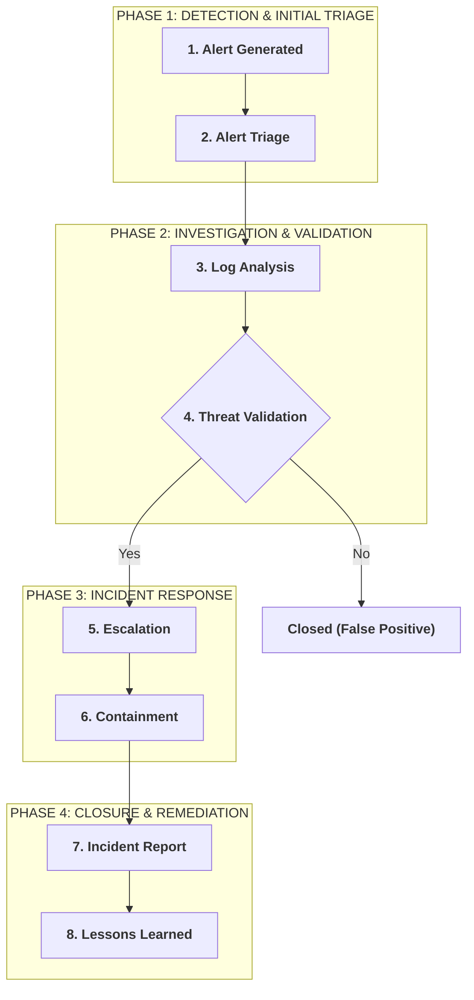

# Junior Security Analyst Intro

## Objective
Understand the responsibilities of a Junior Security Analyst and how a Security Operations Center (SOC) operates.

## Key Concepts

### What is a SOC?
A Security Operations Center (SOC) is responsible for monitoring, detecting, investigating and responding to cyber threats.

### Main Responsibilities

- Monitor security alerts
- Investigate suspicious activity
- Escalate incidents
- Document findings
- Communicate with team members

### SOC Roles

- L1 Analyst
- Senior Analyst (L2)
- SOC Engineer
- Incident Responder
- SOC Manager

### Skills Required

- Networking
- Windows Logs
- SIEM
- Incident Response
- Communication
- Critical Thinking

### Daily Workflow

Alert
↓

Investigation
↓

Classification
↓

Escalation
↓

Remediation
↓

Documentation

## Key Takeaways

- SOC is a team effort.
- Every alert must be investigated.
- Documentation is critical.
- Continuous learning is part of the job.

